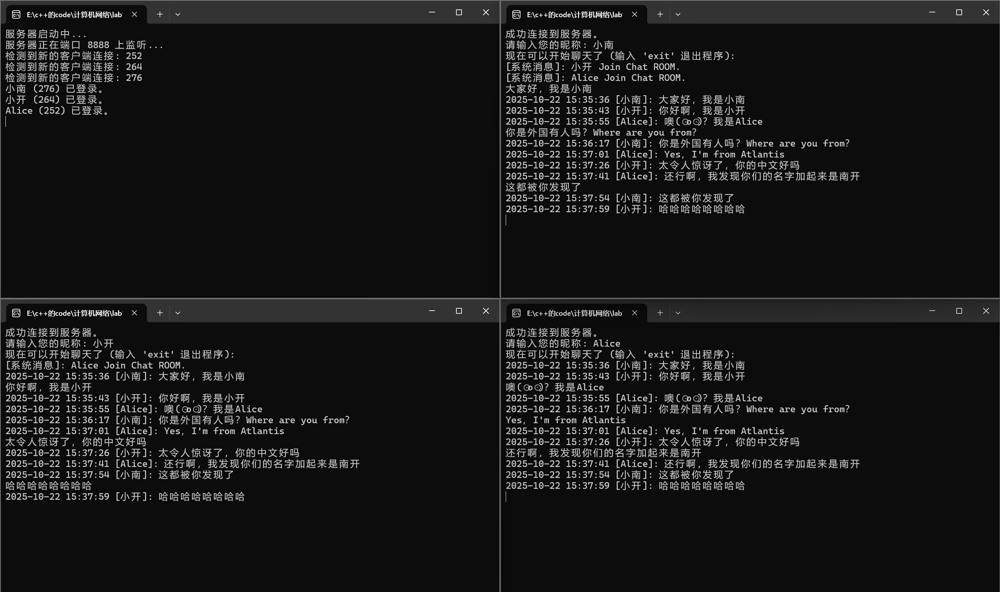
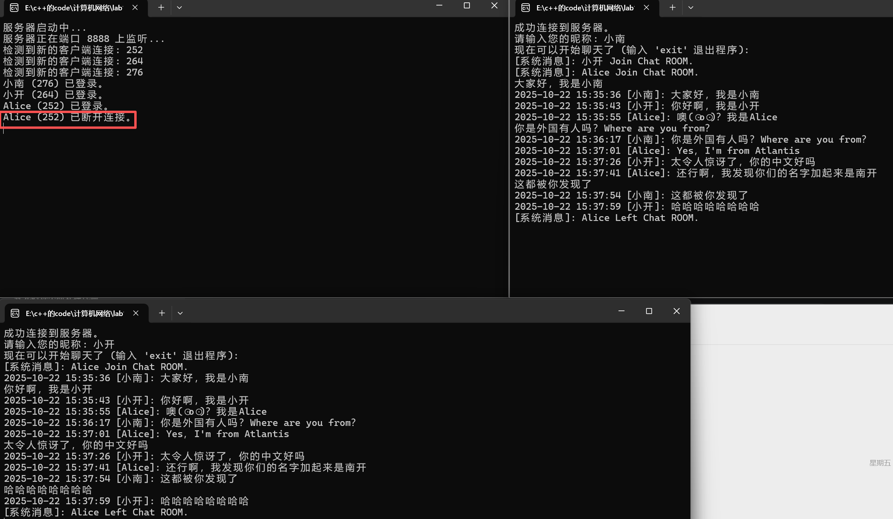
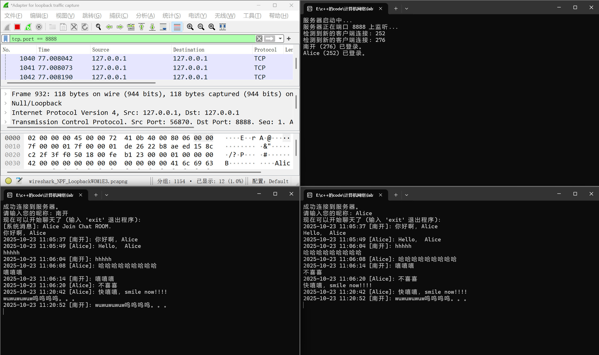
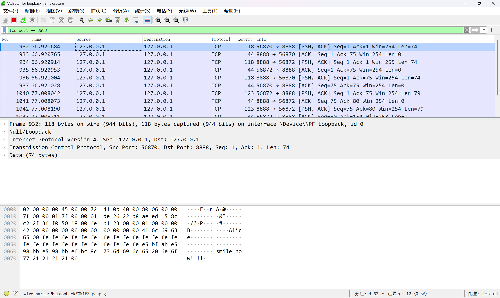

<center>
<h1>计算机网络实验报告</h1>
<h2>LAB1：Socket套接字编程</h2>
<br> 姓名：陈培杰 &nbsp;&nbsp;&nbsp; 学号：2312991 &nbsp;&nbsp;&nbsp; 专业：信息安全
</center>
  
  
- [模块划分](#模块划分 )
    - [模块划分说明](#模块划分说明 )
    - [各模块功能详述](#各模块功能详述 )
      - [服务端程序：](#服务端程序 )
      - [客户端程序：](#客户端程序 )
- [流程图](#流程图 )
    - [服务端主控模块流程图](#服务端主控模块流程图 )
    - [服务端客户端处理模块流程图](#服务端客户端处理模块流程图 )
    - [客户端主控/用户输入模块流程图](#客户端主控用户输入模块流程图 )
    - [客户端消息接收模块流程图](#客户端消息接收模块流程图 )
- [文件目录](#文件目录 )
- [使用方法](#使用方法 )
- [运行结果](#运行结果 )
- [观察数据是否丢失](#观察数据是否丢失 )
- [代码部分](#代码部分 )
  - [protocol.h](#protocolh )
  - [ChatClient.cpp](#chatclientcpp )
  - [ChatServer.cpp](#chatservercpp )
  
# 模块划分
  
### 模块划分说明
本系统采用经典的客户端/服务器 架构，由 **服务端程序**和 **客户端程序** 两大独立部分构成。为了实现多用户实时聊天、保证代码结构清晰和高内聚低耦合，每个程序内部又被划分为若干逻辑模块。
  
  
1. **服务端程序模块划分：**
  
    **主控模块 ：** 服务器的入口和管理中心，负责程序的启动、监听和接受新连接。
  
    **客户端处理模块**  : 服务器的核心业务逻辑，每个客户端连接都由一个独立的此模块实例（在一个单独的线程中）进行处理。
  
    **消息广播模块** ：一个公共服务模块，负责将消息安全地转发给所有或部分在线的客户端。
  
    **协议模块**：定义了客户端和服务端之间通信的数据格式和规则，是两者沟通的“语言”。
  
2. **客户端程序模块划分：**
    **主控模块**：客户端的入口，负责程序的启动、连接服务器以及管理其他模块的生命周期。
  
    **消息接收模块** ：在独立的线程中运行，专门负责从服务器接收数据并处理。
  
    **用户输入模块**：在主线程中运行，负责获取用户的键盘输入并将其发送到服务器。
  
    **协议模块** ：与服务端共享，确保客户端能正确地打包和解析数据。
  
    **编码转换模块** ：负责Windows环境下控制台宽字符(UTF-16)与网络传输字符(UTF-8)之间的转换。
  
### 各模块功能详述
  
#### 服务端程序：
1. 主控模块:
  
    - 初始化 Winsock 网络库。
  
    - 创建、绑定并监听一个TCP Socket，等待客户端的连接请求。
  
    - 在一个无限循环中调用 accept() 函数，一旦有新的客户端连接成功，就为其创建一个新的客户端处理模块实例（即一个新的线程），然后继续等待下一个连接。
  
2. 客户端处理模块:
  
    - 在独立的线程中运行，与单一的客户端进行一对一通信。
  
    - 负责处理该客户端的登录请求，验证并记录其用户名。
  
    - 进入一个循环，持续接收（recv）来自该客户端的数据。
  
    - 根据协议模块的定义，解析收到的消息类型（如聊天、登出等）。
  
    - 若为聊天消息，则调用消息广播模块将其转发给所有其他客户端。
  
    - 若为登出消息或连接断开，则负责清理该客户端的相关资源（如关闭Socket、从在线列表中移除），并通知其他用户。
  
3. 消息广播模块:
  
    - 维护一个全局的、线程安全的在线用户列表（使用 std::mutex 进行保护）。
  
    - 提供一个或多个公共函数，允许客户端处理模块将格式化好的消息缓冲区发送给列表中的所有客户端。
  
    - 能够处理选择性广播（如不发送给消息的原始发送者）。
  
#### 客户端程序：
1. 主控模块:
  
    - 初始化 Winsock 网络库。
  
    - 创建Socket并根据用户提供的IP和端口号连接（connect）到服务器。
  
    - 连接成功后，提示用户输入昵称，并将登录信息打包发送给服务器。
  
    - 创建一个新的消息接收模块实例（即一个新的后台线程）。
  
    - 启动用户输入模块（即在主线程中进入循环）。
  
2. 消息接收模块:
  
    - 在独立的后台线程中运行，避免阻塞用户输入。
  
    - 在一个循环中持续调用 recv() 接收来自服务器的数据。
  
    - 根据协议模块定义解析消息头和消息体，识别消息类型（如系统广播、其他用户的聊天消息等）。
  
    - 调用编码转换模块将收到的UTF-8数据转换为宽字符(wstring)。
  
    - 将格式化后的消息（如时间戳、用户名、内容）输出到控制台。
  
    - 如果与服务器的连接断开，则终止循环并通知主线程。
  
3. 用户输入模块:
  
    - 在主线程循环中运行，使用 getline 获取用户从键盘输入的一整行内容。
  
    - 对输入内容进行判断，如是否为退出命令 "exit"。
  
    - 调用编码转换模块将用户的宽字符输入(wstring)转换为UTF-8(string)。
  
    - 根据协议模块将聊天内容和用户信息打包成网络消息。
  
    - 调用 send() 将打包好的消息发送给服务器。
  
4. 协议模块 和 编码转换模块 是功能性的，它们为其他模块提供数据结构定义和工具函数。
  
# 流程图
  
### 服务端主控模块流程图
```
      (  开始  )
          |
          V
  [ 初始化网络库 ]
          |
          V
[ 创建并绑定监听Socket ]
          |
          V
  [ 开始监听端口 ]
          |
          V
+----< 循环开始 <----+
|         |         |
|         V         |
|  [ 接受客户端连接 ] |
|         |         |
|         V         |
| < 连接是否成功? > | --否--+
|    |    是        |     |
|    V              |     |
| [ 为其创建新线程 ]--+-----+
+-------------------+
```
  
### 服务端客户端处理模块流程图
```
     (  线程开始  )
           |
           V
     [ 接收登录包 ]
           |
           V
  [ 记录用户名, 加入列表 ]
           |
           V
 [ 广播"XXX加入"系统消息 ]
           |
           V
+----< 消息循环 <----+
|          |         |
|          V         |
|    [ 接收新数据 ]   |
|          |         |
|          V         |
| < 连接是否正常? > --否--> [ 广播"XXX离开" ] --+
|     |    是        |                      |
|     V              |                      V
|  < 是何种消息? >   |                 [ 从列表移除 ]
|   |       |        |                      |
| 聊天      登出     |                      V
|   |        |       |                  ( 线程结束 )
|   V        +------>+
| [ 构建广播包, 调用广播模块 ]
+--------------------+
```
  
### 客户端主控/用户输入模块流程图
```
      (  开始  )
          |
          V
  [ 初始化网络库 ]
          |
          V
[ 创建Socket, 连接服务器 ]
          |
          V
  [ 获取昵称, 发送登录包 ]
          |
          V
 [ 创建后台消息接收线程 ]
          |
          V
+----< 用户输入循环 <----+
|          |           |
|          V           |
|   [ 等待键盘输入 ]    |
|          |           |
|          V           |
| < 输入是否为"exit"? > --是--> [ 发送登出包 ] --+
|     |    否          |                     |
|     V                |                     V
| [ 打包聊天消息并发送 ] |                   [ 清理资源 ]
+----------------------+                     |
                                             V
                                           ( 结束 )
```
  
### 客户端消息接收模块流程图
```
     (  线程开始  )
           |
           V
+----< 消息循环 <----+
|          |         |
|          V         |
|    [ 接收新数据 ]   |
|          |         |
|          V         |
| < 连接是否正常? > --否--> [ 通知主线程断开 ] --+
|     |    是        |                      |
|     V              |                      V
| [ 解析消息头和体 ]   |                    ( 线程结束 )
|          |         |
|          V         |
| [ 转换编码并显示 ]   |
+--------------------+
```
  
# 文件目录
```
ChatSolution/
├── ChatClient/
│   ├── protocol.h
│   └── ChatClient.cpp
│
├── ChatServer/
│   ├── protocol.h
│   └── ChatServer.cpp
│
└── x64/
    └── Debug/
        ├── ChatClient.exe
        └── ChatServer.exe
```
  
# 使用方法
  
先双击打开 `ChatServer.exe` ，然后双击打开 `ChatClient.exe` ，`ChatClient.exe`想打开几个就打开几个。
  
然后在 `ChatClient.exe` 中输入名称，之后就可以开始聊天了。输入`exit`退出。
  
# 运行结果
  

这里是聊天的记录，可以看到，包含了英文和中文，都是正常显示。本来在聊天室的用户，可以收到其他后来的用户的登录消息，和其他用户的退出消息。
  

这个图片描述了当一个名叫Alice的用户断开连接时，在客户端和服务器端都会收到其离开的消息。
  
# 观察数据是否丢失
  

这个截图展示了 我 使用WireShark来观察数据包是否有丢失。首先打开WireShark，然后选择` Adapter for loopback traffic capture `，接着在上方输入`tcp.port==8888`，然后就可以观察了。
  
  

  
在这里 如果有 **背景色为黑色、‘Protocol’为TCP、并且 ‘Info’一栏写着 [TCP Retransmission]** 的数据包，那么就是有数据丢失的，但实际上没有。因此没有数据丢失
  
# 代码部分
  
## protocol.h
  
```cpp
#pragma once
  
// 引入固定宽度的整数类型，如 uint32_t, int64_t，确保在不同平台上的大小一致。
#include <cstdint>
  
// 定义消息类型枚举，用于清晰地标识不同消息的用途。
// 使用 enum class 可以避免命名冲突，并提供更强的类型检查。
enum class MessageType : uint32_t {
    // 客户端 -> 服务端：请求登录
    // 消息体: LoginRequestBody
    MSG_LOGIN,
  
    // 客户端 -> 服务端：发送聊天内容
    // 消息体: ChatRequestBody + 聊天文本
    MSG_CHAT,
  
    // 客户端 -> 服务端：请求登出
    // 消息体: 无
    MSG_LOGOUT,
  
    // 服务端 -> 客户端：广播聊天消息
    // 消息体: ChatRequestBody + 聊天文本
    MSG_CHAT_BC, // BC for Broadcast
  
    // 服务端 -> 客户端：发送系统通知 (如 "Alice 加入了聊天")
    // 消息体: 变长的UTF-8字符串
    MSG_SERVER_INFO,
  
    // 服务端 -> 客户端：响应登录/操作结果
    // 消息体: 变长的UTF-8字符串描述错误信息
    MSG_ERROR
};
  
// 定义一些协议中使用的常量
const int USERNAME_MAX_LEN = 32;
  
// 使用 #pragma pack(push, 1) 指令，确保编译器按1字节对齐。
// 这对于网络编程至关重要，可以防止因编译器内存对齐优化
// 导致结构体在发送端和接收端大小不一致的问题。
#pragma pack(push, 1)
  
// 通用消息头
// 所有消息都以此结构体开头
struct MessageHeader {
    MessageType msgType; // 消息的类型
    uint32_t bodySize;   // 紧跟在消息头之后的消息体总长度（字节）
};
  
// 登录请求的消息体
struct LoginRequestBody {
    char username[USERNAME_MAX_LEN]; // 用户名，以'\0'结尾的字符串
};
  
// 聊天消息的消息体
// 注意：这个结构体后面还紧跟着变长的聊天内容文本。
// bodySize = sizeof(ChatRequestBody) + 聊天文本的长度
struct ChatRequestBody {
    int64_t timestamp;               // 服务器生成或转发的时间戳 (例如 time(0))
    char username[USERNAME_MAX_LEN]; // 发送消息的用户名
};
  
#pragma pack(pop) // 恢复默认的内存对齐方式
```
  
## ChatClient.cpp
```cpp
#define WIN32_LEAN_AND_MEAN
  
#include <iostream>
#include <winsock2.h>
#include <ws2tcpip.h>
#include <thread>
#include <string>
#include <vector>
#include <atomic>
#include <ctime>
#include <iomanip>
#include <sstream>
  
// 为了使用_setmode, wcout等
#include <io.h>
#include <fcntl.h>
  
#include "protocol.h"
  
#pragma comment(lib, "ws2_32.lib")
  
using namespace std;
  
atomic<bool> g_isConnected(false);
  
// --- 编码转换函数 ---
// 将 UTF-8 (char*) 字符串转换为 UTF-16 (wstring)
wstring Utf8ToWstring(const string& str) {
    if (str.empty()) return wstring();
    int size_needed = MultiByteToWideChar(CP_UTF8, 0, &str[0], (int)str.size(), NULL, 0);
    wstring wstrTo(size_needed, 0);
    MultiByteToWideChar(CP_UTF8, 0, &str[0], (int)str.size(), &wstrTo[0], size_needed);
    return wstrTo;
}
  
// 将 UTF-16 (wstring) 转换为 UTF-8 (string)
string WstringToUtf8(const wstring& wstr) {
    if (wstr.empty()) return string();
    int size_needed = WideCharToMultiByte(CP_UTF8, 0, &wstr[0], (int)wstr.size(), NULL, 0, NULL, NULL);
    string strTo(size_needed, 0);
    WideCharToMultiByte(CP_UTF8, 0, &wstr[0], (int)wstr.size(), &strTo[0], size_needed, NULL, NULL);
    return strTo;
}
// --- 编码转换函数结束 ---
  
  
void ReceiveMessages(SOCKET serverSocket);
string FormatTimestamp(int64_t timestamp);
  
int main() {
    // *** 关键改动: 设置控制台输入输出为UTF-16模式 ***
    _setmode(_fileno(stdout), _O_U16TEXT);
    _setmode(_fileno(stdin), _O_U16TEXT);
  
    WSADATA wsaData;
    if (WSAStartup(MAKEWORD(2, 2), &wsaData) != 0) {
        wcerr << L"WSAStartup 失败, 错误码: " << WSAGetLastError() << endl;
        return 1;
    }
  
    SOCKET serverSocket = socket(AF_INET, SOCK_STREAM, IPPROTO_TCP);
    if (serverSocket == INVALID_SOCKET) {
        wcerr << L"创建 Socket 失败, 错误码: " << WSAGetLastError() << endl;
        WSACleanup();
        return 1;
    }
  
    sockaddr_in serverAddr;
    serverAddr.sin_family = AF_INET;
    serverAddr.sin_port = htons(8888);
    inet_pton(AF_INET, "127.0.0.1", &serverAddr.sin_addr);
  
    if (connect(serverSocket, (SOCKADDR*)&serverAddr, sizeof(serverAddr)) == SOCKET_ERROR) {
        wcerr << L"连接服务器失败, 错误码: " << WSAGetLastError() << endl;
        closesocket(serverSocket);
        WSACleanup();
        return 1;
    }
  
    wcout << L"成功连接到服务器。" << endl;
    g_isConnected = true;
  
    wstring w_username; // 使用wstring
    wcout << L"请输入您的昵称: ";
    getline(wcin, w_username); // 使用wcin
  
    string username = WstringToUtf8(w_username); // 转换为UTF-8用于网络传输
  
    if (username.length() >= USERNAME_MAX_LEN) {
        wcerr << L"错误: 昵称过长，请保持在 " << USERNAME_MAX_LEN - 1 << L" 个字符以内。" << endl;
        g_isConnected = false;
    }
    else {
        MessageHeader header;
        header.msgType = MessageType::MSG_LOGIN;
        header.bodySize = sizeof(LoginRequestBody);
  
        LoginRequestBody loginBody;
        strncpy_s(loginBody.username, username.c_str(), _TRUNCATE);
  
        send(serverSocket, (const char*)&header, sizeof(header), 0);
        send(serverSocket, (const char*)&loginBody, sizeof(loginBody), 0);
    }
  
    thread recvThread(ReceiveMessages, serverSocket);
    recvThread.detach();
  
    wcout << L"现在可以开始聊天了 (输入 'exit' 退出程序):" << endl;
    wstring w_line;
    while (g_isConnected) {
        getline(wcin, w_line); // 使用wcin
  
        if (!g_isConnected) break;
        if (w_line.empty()) continue;
        if (w_line == L"exit") break;
  
        string line = WstringToUtf8(w_line); // 转换为UTF-8用于网络传输
  
        MessageHeader chatHeader;
        chatHeader.msgType = MessageType::MSG_CHAT;
  
        ChatRequestBody chatBody;
        strncpy_s(chatBody.username, username.c_str(), _TRUNCATE);
        chatBody.timestamp = 0;
  
        chatHeader.bodySize = sizeof(ChatRequestBody) + line.length() + 1;
        vector<char> buffer(sizeof(MessageHeader) + chatHeader.bodySize);
  
        memcpy(buffer.data(), &chatHeader, sizeof(MessageHeader));
        memcpy(buffer.data() + sizeof(MessageHeader), &chatBody, sizeof(ChatRequestBody));
        memcpy(buffer.data() + sizeof(MessageHeader) + sizeof(ChatRequestBody), line.c_str(), line.length() + 1);
  
        if (send(serverSocket, buffer.data(), buffer.size(), 0) == SOCKET_ERROR) {
            wcerr << L"消息发送失败。" << endl;
            break;
        }
    }
  
    if (g_isConnected) {
        MessageHeader logoutHeader;
        logoutHeader.msgType = MessageType::MSG_LOGOUT;
        logoutHeader.bodySize = 0;
        send(serverSocket, (const char*)&logoutHeader, sizeof(logoutHeader), 0);
    }
  
    wcout << L"正在断开连接..." << endl;
    g_isConnected = false;
    closesocket(serverSocket);
    WSACleanup();
    Sleep(1000);
    return 0;
}
  
void ReceiveMessages(SOCKET serverSocket) {
    while (g_isConnected) {
        MessageHeader header;
        int bytesRead = recv(serverSocket, (char*)&header, sizeof(header), 0);
  
        if (bytesRead <= 0) {
            if (g_isConnected) {
                wcerr << L"\n与服务器的连接已断开。" << endl;
            }
            g_isConnected = false;
            break;
        }
  
        vector<char> bodyBuffer;
        if (header.bodySize > 0) {
            bodyBuffer.resize(header.bodySize);
            int bodyBytesRead = recv(serverSocket, bodyBuffer.data(), header.bodySize, MSG_WAITALL);
            if (bodyBytesRead <= 0) {
                if (g_isConnected) {
                    wcerr << L"\n接收消息体失败，连接已断开。" << endl;
                }
                g_isConnected = false;
                break;
            }
        }
  
        switch (header.msgType) {
        case MessageType::MSG_CHAT_BC: {
            ChatRequestBody* chatBody = (ChatRequestBody*)bodyBuffer.data();
            const char* messageText = bodyBuffer.data() + sizeof(ChatRequestBody);
  
            // 将收到的UTF-8数据转换为wstring用于显示
            wstring w_username = Utf8ToWstring(chatBody->username);
            wstring w_messageText = Utf8ToWstring(messageText);
  
            wstringstream wss;
            wss << L"\r"
                << Utf8ToWstring(FormatTimestamp(chatBody->timestamp)).c_str()
                << L" [" << w_username << L"]: " << w_messageText << endl;
            wcout << wss.str();
            wcout.flush();
            break;
        }
        case MessageType::MSG_SERVER_INFO: {
            wstring w_message = Utf8ToWstring(bodyBuffer.data());
            wcout << L"\r[系统消息]: " << w_message << endl;
            wcout.flush();
            break;
        }
        case MessageType::MSG_ERROR: {
            wstring w_message = Utf8ToWstring(bodyBuffer.data());
            wcerr << L"\r[服务器错误]: " << w_message << endl;
            wcout.flush();
            break;
        }
        default:
            wcerr << L"\r收到未知的消息类型: " << static_cast<int>(header.msgType) << endl;
            break;
        }
    }
}
  
// 这个函数无需修改，因为它的输出是string，会被转换
string FormatTimestamp(int64_t timestamp) {
    time_t time = timestamp;
    tm local_tm;
    localtime_s(&local_tm, &time);
    stringstream ss;
    ss << put_time(&local_tm, "%Y-%m-%d %H:%M:%S");
    return ss.str();
}
```
## ChatServer.cpp
  
```cpp
#define WIN32_LEAN_AND_MEAN
  
#include <iostream>
#include <winsock2.h>
#include <ws2tcpip.h>
#include <thread>
#include <vector>
#include <string>
#include <mutex>
#include <algorithm>
#include <ctime>
  
// 新增的头文件，用于宽字符输出
#include <io.h>
#include <fcntl.h>
  
#include "protocol.h"
  
#pragma comment(lib, "ws2_32.lib")
  
// 用于存储客户端信息的结构体
struct ClientInfo {
    SOCKET socket;
    std::string username; // 仍然使用string(UTF-8)存储，因为网络传输需要
};
  
// 全局变量
std::vector<ClientInfo> g_clients;
std::mutex g_clients_mutex;
  
// --- 新增：编码转换函数 (从client.cpp复制而来) ---
// 将 UTF-8 (char*) 字符串转换为 UTF-16 (wstring)
std::wstring Utf8ToWstring(const std::string& str) {
    if (str.empty()) return std::wstring();
    int size_needed = MultiByteToWideChar(CP_UTF8, 0, &str[0], (int)str.size(), NULL, 0);
    std::wstring wstrTo(size_needed, 0);
    MultiByteToWideChar(CP_UTF8, 0, &str[0], (int)str.size(), &wstrTo[0], size_needed);
    return wstrTo;
}
  
// 函数声明
void HandleClient(SOCKET clientSocket);
void BroadcastBuffer(const char* buffer, int size, SOCKET excludeSocket = INVALID_SOCKET);
void BroadcastSystemMessage(const std::string& message, SOCKET excludeSocket = INVALID_SOCKET);
  
int main() {
    // *** 关键改动：设置服务器控制台输出为UTF-16模式 ***
    _setmode(_fileno(stdout), _O_U16TEXT);
    _setmode(_fileno(stderr), _O_U16TEXT);
  
    WSADATA wsaData;
    if (WSAStartup(MAKEWORD(2, 2), &wsaData) != 0) {
        std::wcerr << L"WSAStartup 失败, 错误码: " << WSAGetLastError() << std::endl;
        return 1;
    }
    std::wcout << L"服务器启动中..." << std::endl;
  
    SOCKET listenSocket = socket(AF_INET, SOCK_STREAM, IPPROTO_TCP);
    if (listenSocket == INVALID_SOCKET) {
        std::wcerr << L"创建 Socket 失败, 错误码: " << WSAGetLastError() << std::endl;
        WSACleanup();
        return 1;
    }
  
    sockaddr_in serverAddr;
    serverAddr.sin_family = AF_INET;
    serverAddr.sin_addr.s_addr = INADDR_ANY;
    serverAddr.sin_port = htons(8888);
  
    if (bind(listenSocket, (SOCKADDR*)&serverAddr, sizeof(serverAddr)) == SOCKET_ERROR) {
        std::wcerr << L"绑定失败, 错误码: " << WSAGetLastError() << std::endl;
        closesocket(listenSocket);
        WSACleanup();
        return 1;
    }
  
    if (listen(listenSocket, SOMAXCONN) == SOCKET_ERROR) {
        std::wcerr << L"监听失败, 错误码: " << WSAGetLastError() << std::endl;
        closesocket(listenSocket);
        WSACleanup();
        return 1;
    }
  
    std::wcout << L"服务器正在端口 8888 上监听..." << std::endl;
  
    while (true) {
        SOCKET clientSocket = accept(listenSocket, NULL, NULL);
        if (clientSocket == INVALID_SOCKET) {
            std::wcerr << L"接受连接失败, 错误码: " << WSAGetLastError() << std::endl;
            continue;
        }
  
        std::wcout << L"检测到新的客户端连接: " << clientSocket << std::endl;
  
        std::thread clientThread(HandleClient, clientSocket);
        clientThread.detach();
    }
  
    closesocket(listenSocket);
    WSACleanup();
  
    return 0;
}
  
void HandleClient(SOCKET clientSocket) {
    ClientInfo clientInfo;
    clientInfo.socket = clientSocket;
    clientInfo.username = "匿名用户";
  
    {
        MessageHeader header;
        int bytesRead = recv(clientSocket, (char*)&header, sizeof(header), 0);
        if (bytesRead <= 0 || header.msgType != MessageType::MSG_LOGIN) {
            std::wcerr << L"客户端 " << clientSocket << L" 未发送登录包或连接中断。" << std::endl;
            closesocket(clientSocket);
            return;
        }
  
        LoginRequestBody loginBody;
        recv(clientSocket, (char*)&loginBody, sizeof(loginBody), MSG_WAITALL);
        loginBody.username[USERNAME_MAX_LEN - 1] = '\0';
        clientInfo.username = loginBody.username;
  
        {
            std::lock_guard<std::mutex> lock(g_clients_mutex);
            g_clients.push_back(clientInfo);
        }
  
        // *** 关键改动：使用wcout并转换编码 ***
        std::wstring w_username = Utf8ToWstring(clientInfo.username);
        std::wcout << w_username << L" (" << clientSocket << L") 已登录。" << std::endl;
  
        std::string welcomeMsg = clientInfo.username + " Join Chat ROOM.";
        BroadcastSystemMessage(welcomeMsg, clientSocket);
    }
  
  
    while (true) {
        MessageHeader header;
        int bytesRead = recv(clientSocket, (char*)&header, sizeof(header), 0);
        if (bytesRead <= 0) {
            break;
        }
  
        std::vector<char> bodyBuffer;
        if (header.bodySize > 0) {
            bodyBuffer.resize(header.bodySize);
            recv(clientSocket, bodyBuffer.data(), header.bodySize, MSG_WAITALL);
        }
  
        switch (header.msgType) {
        case MessageType::MSG_CHAT: {
            ChatRequestBody* clientChatBody = (ChatRequestBody*)bodyBuffer.data();
            const char* messageText = bodyBuffer.data() + sizeof(ChatRequestBody);
  
            MessageHeader bc_header;
            bc_header.msgType = MessageType::MSG_CHAT_BC;
  
            ChatRequestBody bc_chatBody;
            strncpy_s(bc_chatBody.username, clientInfo.username.c_str(), _TRUNCATE);
            bc_chatBody.timestamp = time(0);
  
            std::string text(messageText);
            bc_header.bodySize = sizeof(ChatRequestBody) + text.length() + 1;
  
            std::vector<char> bc_buffer(sizeof(MessageHeader) + bc_header.bodySize);
            memcpy(bc_buffer.data(), &bc_header, sizeof(MessageHeader));
            memcpy(bc_buffer.data() + sizeof(MessageHeader), &bc_chatBody, sizeof(ChatRequestBody));
            memcpy(bc_buffer.data() + sizeof(MessageHeader) + sizeof(ChatRequestBody), text.c_str(), text.length() + 1);
  
            BroadcastBuffer(bc_buffer.data(), bc_buffer.size());
            break;
        }
        case MessageType::MSG_LOGOUT: {
            goto cleanup;
        }
        default:
            std::wcerr << L"收到来自 " << Utf8ToWstring(clientInfo.username) << L" 的未知消息类型。" << std::endl;
            break;
        }
    }
  
cleanup:
    closesocket(clientSocket);
  
    {
        std::lock_guard<std::mutex> lock(g_clients_mutex);
        g_clients.erase(
            std::remove_if(g_clients.begin(), g_clients.end(),
                [clientSocket](const ClientInfo& ci) {
                    return ci.socket == clientSocket;
                }),
            g_clients.end());
    }
  
    // *** 关键改动：使用wcout并转换编码 ***
    std::wstring w_username_dc = Utf8ToWstring(clientInfo.username);
    std::wcout << w_username_dc << L" (" << clientSocket << L") 已断开连接。" << std::endl;
  
    std::string farewellMsg = clientInfo.username + " Left Chat ROOM.";
    BroadcastSystemMessage(farewellMsg);
}
  
void BroadcastBuffer(const char* buffer, int size, SOCKET excludeSocket) {
    std::lock_guard<std::mutex> lock(g_clients_mutex);
    for (const auto& client : g_clients) {
        if (client.socket != excludeSocket) {
            send(client.socket, buffer, size, 0);
        }
    }
}
  
void BroadcastSystemMessage(const std::string& message, SOCKET excludeSocket) {
    MessageHeader header;
    header.msgType = MessageType::MSG_SERVER_INFO;
    header.bodySize = message.length() + 1;
  
    std::vector<char> buffer(sizeof(MessageHeader) + header.bodySize);
    memcpy(buffer.data(), &header, sizeof(MessageHeader));
    memcpy(buffer.data() + sizeof(MessageHeader), message.c_str(), message.length() + 1);
  
    BroadcastBuffer(buffer.data(), buffer.size(), excludeSocket);
}
```
  